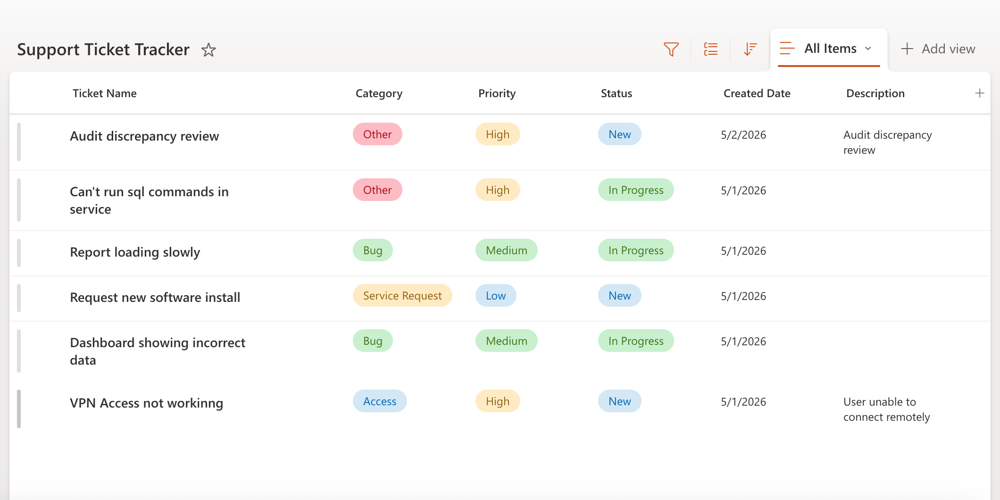
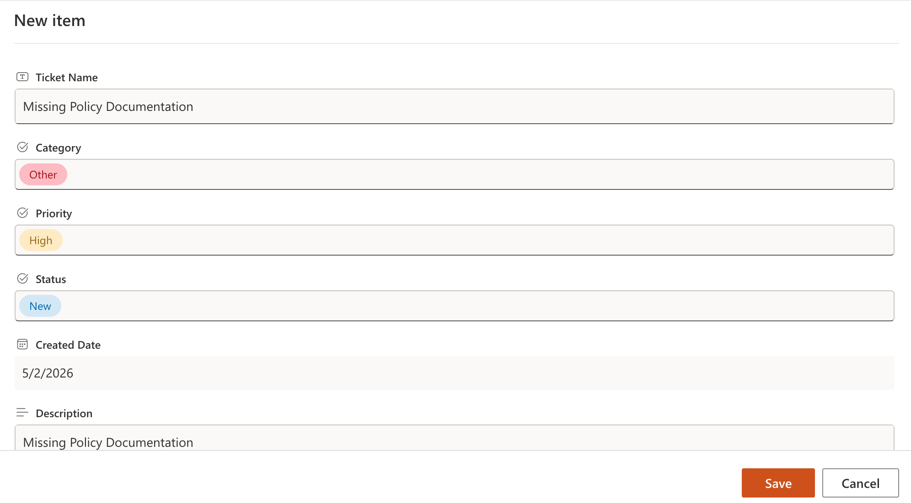
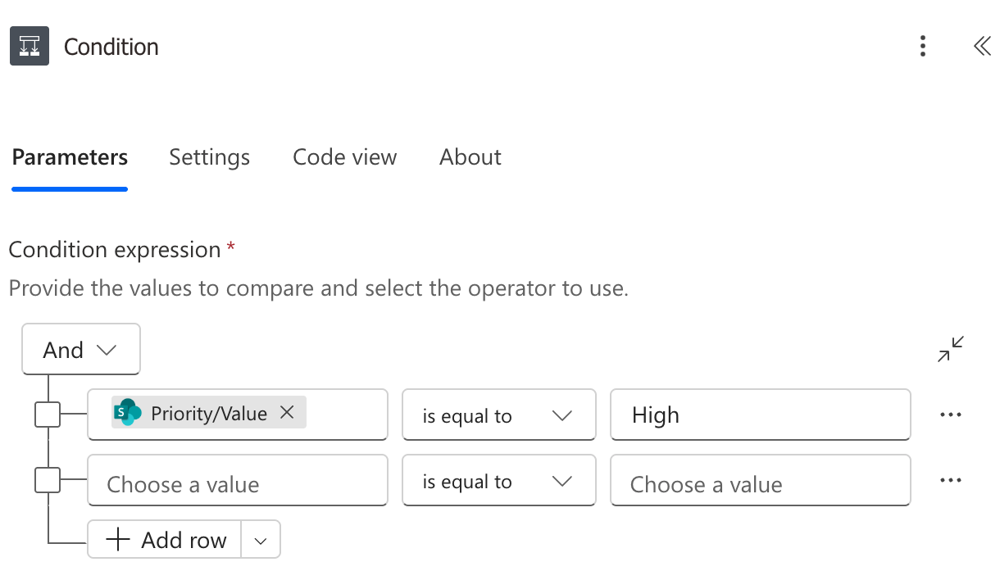
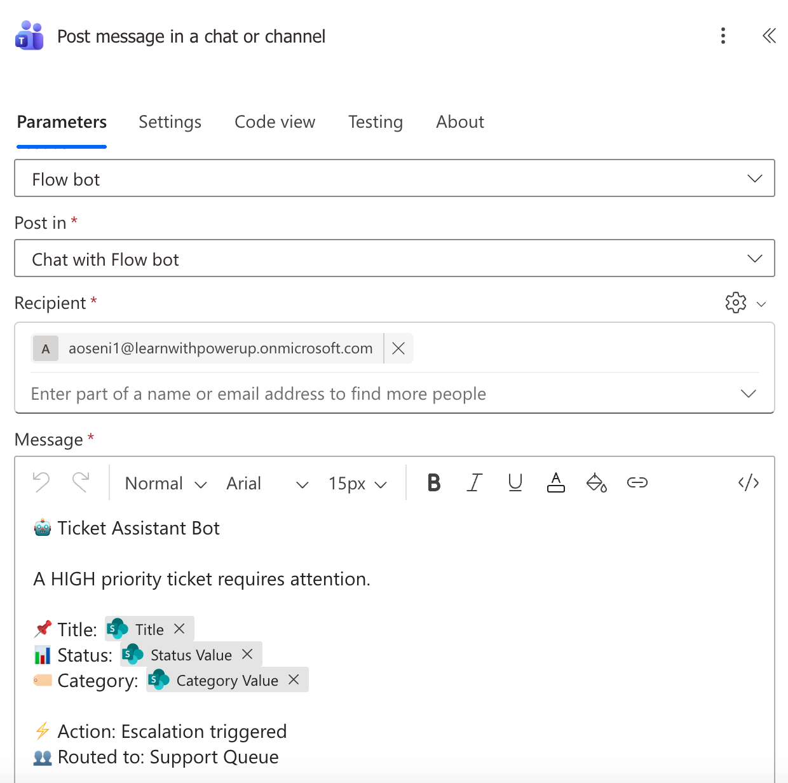
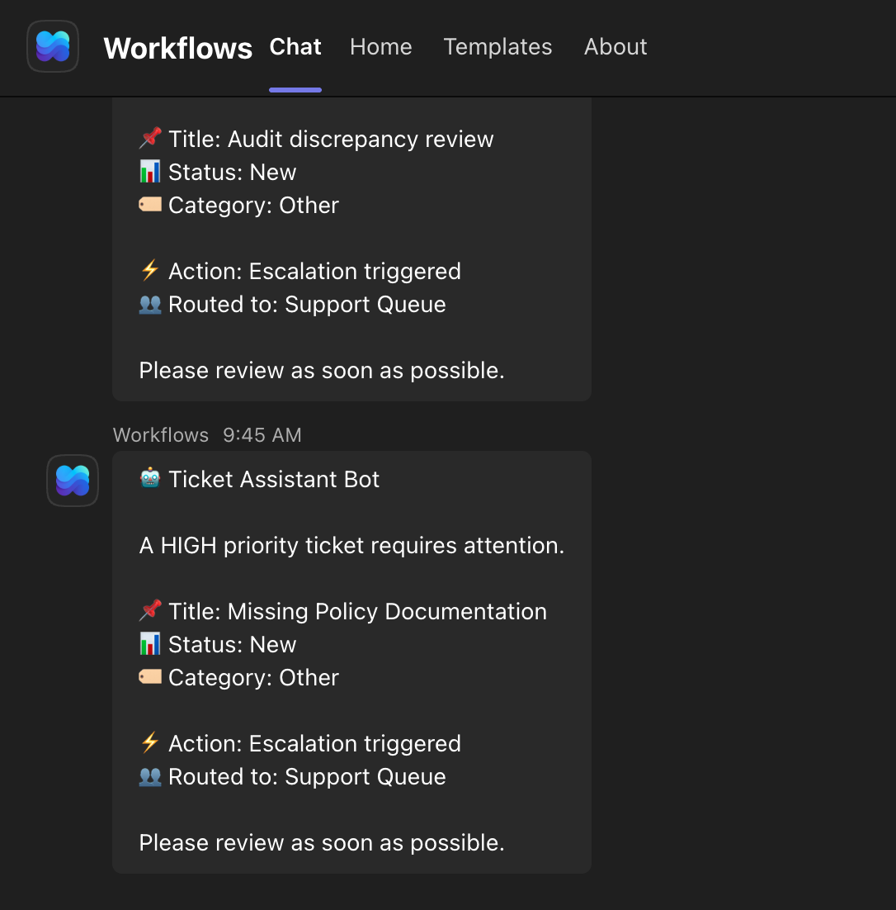
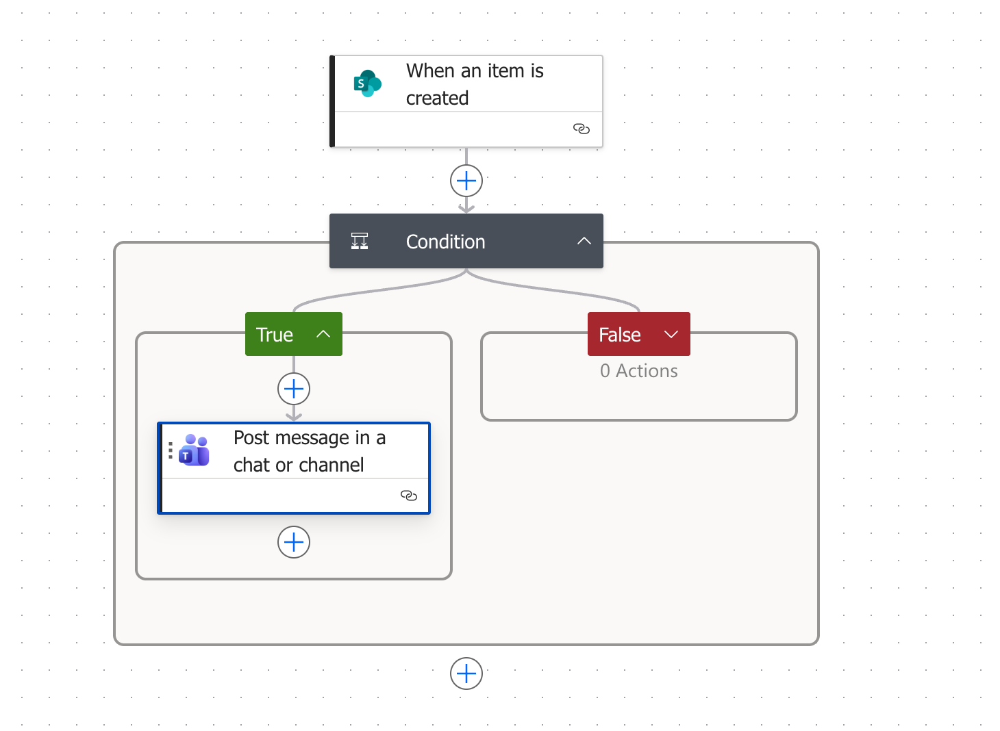

# Operational-Ticket-Monitoring-And-Escalation-System

## Overview

This project simulates an operational workflow system used to track, prioritize, and respond to internal requests. It demonstrates how business rules, data tracking, and reporting can be integrated using Microsoft Power Platform tools.

The system enables:

- Structured intake of operational requests
- Automated detection of high-priority items
- Real-time notifications with contextual data

## System Architecture

SharePoint List → Intake and data storage

Power Automate → Workflow automation and business rules

Notification Layer (Teams/Email) → Real-time alerts

## Key Features

Tracks tickets with fields such as:

- Title
- Priority (Low / Medium / High)
- Status (New, In Progress, Closed)
- Category

Automatically detects High priority tickets

Sends dynamic notifications including

- Ticket title
- Status
- Additional context
  :

Simulates real-world operational workflows and escalation patterns

## Workflow Logic

A new ticket is created in the SharePoint list
Power Automate evaluates ticket priority
If priority = High:
Trigger notification
Include dynamic ticket details
Otherwise:
No escalation triggered

## Challenges & Learnings

Dynamic Content Handling

- Resolved issues with rendering SharePoint fields (e.g., using Status Value instead of object references)

Conditional Logic Debugging

- Fixed condition evaluation errors by correctly referencing nested field values

Connection & Authentication Issues

- Resolved connector failures caused by invalid or unlicensed connections

These challenges reflect common real-world issues when working with enterprise workflow automation tools.

## Outcome

Built a functional end-to-end workflow that:

Reduces manual monitoring effort
Improves response time for high-priority items
Demonstrates practical application of Power Platform in operational settings

## Future Enhancements

SLA tracking and time-based escalation
Power BI dashboard for reporting and trend analysis
Expanded workflow logic for multi-team routing
